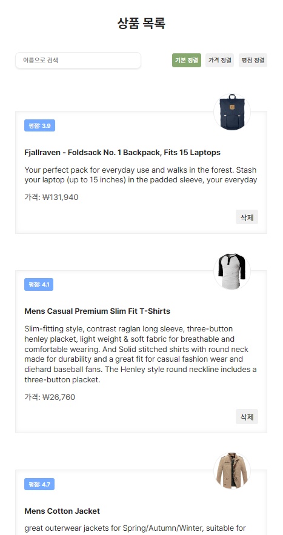
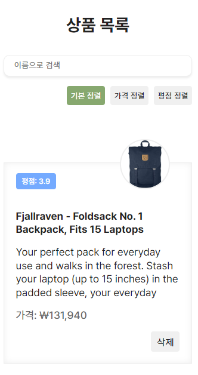

# 상품 정보 확인 사이트 (Product Info App)

개인 프로젝트 [React, HTML, CSS]

## 프로젝트 소개

Fake Store API 사용하여 상품 정보를 가져오고, 가져온 데이터를 활용하여 구현한 사이트입니다.

[👉🏻 Product Info App](https://hy0ni.github.io/product-app/)

## 기능

- **상품 목록 조회**: 사용자에게 다양한 상품의 리스트를 카드 형식으로 제공
- **상품 카드 삭제**: 상품 목록에서 불필요한 상품을 제거할 수 있는 카드 삭제 기능 버튼 구현
- **상품 이름 검색**: 상품명을 기준으로 검색할 수 있는 기능 구현   
검색 시 공백을 제거하고 소문자로 변환하여 대소문자 무관하게 검색이 가능합니다.
- **기본 정렬**: API를 통해 처음 불러올 때 기본 정렬된 상태로 표시됩니다.
- **평점 순 정렬**: 상품의 평점을 기준으로 내림차순으로 정렬하여, 평점이 높은 상품부터 볼 수 있습니다.
- **가격 순 정렬**: 상품의 가격을 기준으로 저가 상품부터 높은 가격 순으로 정렬하여, 저렴한 상품부터 볼 수 있습니다.
- **반응형 디자인**: 다양한 디바이스에서 최적화된 사용자 경험을 제공하기 위한 반응형 UI 구현

## 주요 개념: Events, useEffect, Fetch API

### Events

- **이벤트 핸들링**: 사용자 상호작용에 따라 UI의 상태를 변화시키는 이벤트를 관리. 클릭, 입력 등 다양한 이벤트에 대한 핸들러를 구현하여 동적인 사용자 경험 제공.

### useEffect

- **useEffect 훅**: `useEffect` 훅을 통해 컴포넌트가 로드될 때 API에서 데이터를 비동기적으로 가져오고, 상태 관리에 저장하여 UI에 반영.

### Fetch API

- **Fetch API**: `Fetch API`를 사용하여 외부 API로부터 상품 데이터를 받아오고, 해당 데이터를 상태 관리에 저장.

 

| pc                                          | mobile                                      |
| ------------------------------------------- | ------------------------------------------- |
|  |  |
